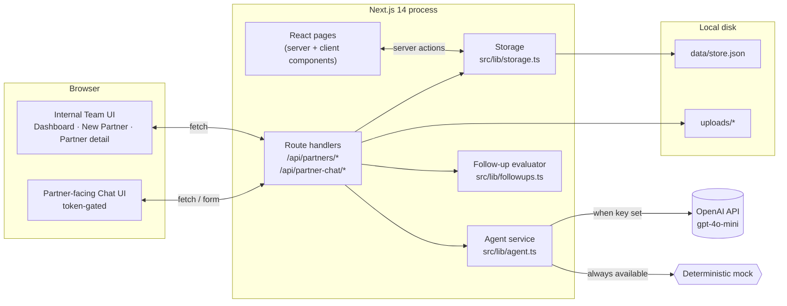
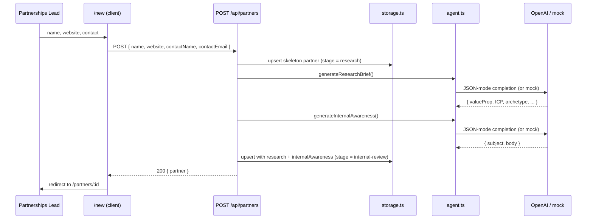

# 2. Architecture

The application is a single Next.js 14 (App Router) process. There is no separate API server, no queue worker, no database. Everything is server-rendered React + server route handlers + a file-backed JSON store.

## System diagram



## Source layout

```
src/
├─ app/                       # Next.js App Router
│  ├─ layout.tsx              # Root layout: shell, header, theme
│  ├─ page.tsx                # Dashboard
│  ├─ new/                    # New partner form
│  ├─ partners/[id]/          # Internal partner workspace (tabbed)
│  ├─ partner-chat/[token]/   # Partner-facing chat
│  └─ api/                    # Route handlers (see api-reference.md)
├─ components/                # Shared UI
│  ├─ AppHeader.tsx           # Path-aware header (internal vs partner)
│  ├─ Markdown.tsx            # react-markdown + GFM
│  ├─ PartnerCard.tsx         # Dashboard partner tile
│  └─ StageRail.tsx           # 7-stage progress rail
└─ lib/                       # Domain layer (no React)
   ├─ types.ts                # Domain types
   ├─ agent.ts                # OpenAI + mock fallback
   ├─ storage.ts              # File-backed JSON store w/ write lock
   ├─ followups.ts            # 10/20/30-day silence detector
   ├─ time.ts                 # Time helpers + SIMULATED_TODAY
   └─ utils.ts                # cn(), stage labels, archetype colors

scripts/
└─ seed.ts                    # Loads 4 demo partners across stages

data/store.json               # Single JSON store (gitignored)
uploads/                      # Files uploaded via partner chat (gitignored)
```

## Layers

The codebase is split into four layers, each with a single responsibility:

1. **UI (`src/app/**/*.tsx`, `src/components`).** React server and client components. Only this layer knows about React.
2. **API (`src/app/api`).** Route handlers. Thin HTTP wrappers that orchestrate the lib layer.
3. **Domain library (`src/lib`).** All business logic, agent orchestration, persistence, and time math. Has no React import.
4. **Storage.** A JSON file. Could be swapped for Postgres/SQLite by replacing `src/lib/storage.ts` only.

## State machine

Each partner moves through a directed graph of stages:

```mermaid
stateDiagram-v2
  [*] --> research: POST /api/partners
  research --> internal-review: research brief generated
  internal-review --> partner-chat: launch chat (after approval)
  partner-chat --> summarized: chat closed by partner
  summarized --> launching: timeline generated
  launching --> live: "New Partner is Live" marked sent
  live --> retro: 30-day metrics submitted
  retro --> [*]
```

The stage is stored on `partner.stage` and drives:

- The pipeline pill colour on the dashboard
- The default tab when opening a partner detail page
- Which buttons are enabled (e.g. "Approve & Launch to Partner" only after internal awareness is approved)
- Whether follow-up alerts are evaluated (skipped once `stage ≥ summarized`)

See [Workflows](./03-workflows.md) for the user-facing journey across these stages.

## Request lifecycle (create-partner example)



Two LLM calls happen sequentially. Each call has a try/catch around the OpenAI path and falls through to the mock if anything fails. The mock is good enough that the user cannot tell from the UI whether OpenAI was used (other than the badge in the header).

## Concurrency & write safety

The storage layer is a single JSON file. Concurrent writes (e.g. two partners being created simultaneously) are serialised through an in-process promise chain:

```ts
let writeLock: Promise<unknown> = Promise.resolve();

export async function writeStore(store: Store): Promise<void> {
  const run = async () => {
    const tmp = STORE_PATH + ".tmp";
    await fs.writeFile(tmp, JSON.stringify(store, null, 2), "utf8");
    await fs.rename(tmp, STORE_PATH);
  };
  writeLock = writeLock.then(run, run);
  await writeLock;
}
```

This gives us:

- **Atomicity** — `rename` is atomic on POSIX, so readers never see a half-written file.
- **Ordering** — operations enqueued via `updatePartner` run in submission order.

It does **not** protect against multi-process writers (e.g. running two `next dev` instances against the same `data/`). For a hackathon this is fine; for production you'd swap for a real DB (see [Operations](./08-operations.md)).

## Why these choices

| Decision | Alternative | Why we picked this |
| - | - | - |
| Next.js full-stack | Express + React | One process, one build, one deploy. App Router gives us server components for "free" perf. |
| JSON file store | Postgres / SQLite | Zero setup. Inspectable with any text editor during development. Easy to swap behind the `storage.ts` interface. |
| File uploads on disk | S3 / Blob | Same reason. The `uploads/` dir is one read away from any future migration. |
| Agent mock fallback | OpenAI-only | Demo works without an API key. CI/tests don't need credentials. Single LLM hiccup degrades gracefully. |
| No queue | Cron / BullMQ | Follow-ups are evaluated on read (the partner detail GET runs the evaluator). Fine for the demo; trivially upgradeable to a worker. |
| Token in URL = auth | OAuth / magic links | Hackathon scope. The token is `nanoid(14)` — 14 alphanumerics is ~83 bits — and is only meaningful with the partner. |
