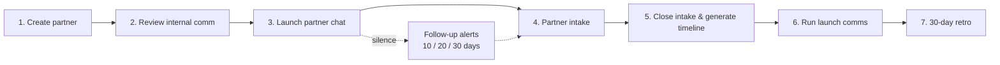
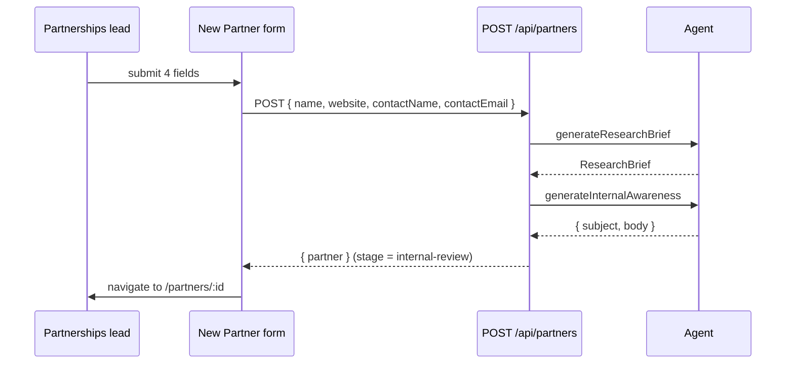
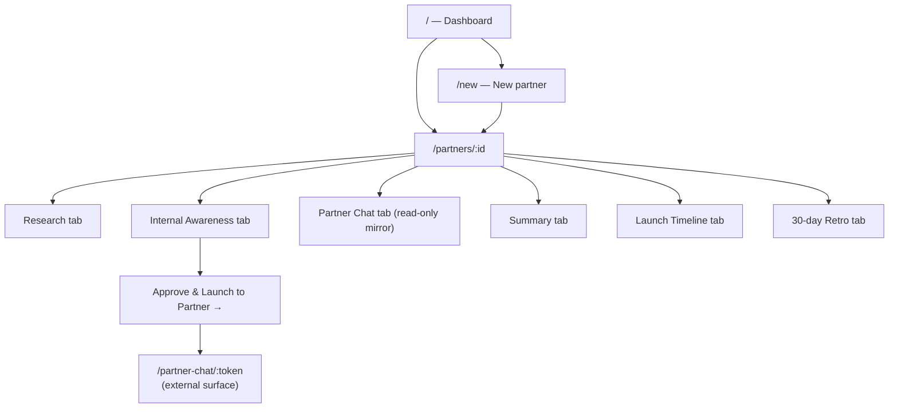

# 3. Workflows

This document walks through the seven user journeys end-to-end. Each one corresponds to a stage in the partner state machine.



---

## 1. Create partner

**Actor:** Partnerships lead (internal)
**Surface:** `/new`
**Stage transition:** _(none)_ → `research` → `internal-review`

The user provides four fields: partner name, website, contact name, contact email. On submit, the API:

1. Creates a skeleton `Partner` (stage = `research`).
2. Calls `generateResearchBrief()` → fills `partner.research`.
3. Calls `generateInternalAwareness()` → fills `partner.internalAwareness`.
4. Persists, transitions stage to `internal-review`, returns the full partner.

The UI then redirects to `/partners/:id`. Total time end-to-end is typically 2–6 seconds with OpenAI, sub-second with the mock.



---

## 2. Review internal awareness comm

**Actor:** Partnerships lead
**Surface:** `/partners/:id` → "Internal Awareness" tab
**Stage transition:** stays at `internal-review`

The draft is shown in a Markdown preview. The user can:

- **Edit** the subject and body inline.
- **Regenerate** to ask the agent for a fresh take (disabled after approval).
- **Approve** to lock the draft and unlock the "Approve & Launch to Partner" CTA on the next card.

`POST /api/partners/:id/internal-awareness` takes an `action` field: `edit | regenerate | approve`. Approval sets `internalAwareness.approvedAt`.

The "Research" tab on the same page is read-only — it shows value prop, ICP, archetype + rationale, scope, competitive landscape, and risk flags.

---

## 3. Launch the partner chat

**Actor:** Partnerships lead
**Surface:** Internal Awareness tab → "Approve & Launch to Partner"
**Stage transition:** `internal-review` → `partner-chat`

Hitting the button calls `POST /api/partners/:id/launch-chat`. The API:

1. Generates a `nanoid(14)` chat token.
2. Builds the welcome message (`partnerChatPrompt({ step: "welcome" })`).
3. Persists `partnerChat` with `step = "review-details"` and one agent message.

The internal UI then shows the partner-facing share link. Clicking the link opens `/partner-chat/:token` in a new tab.

---

## 4. Partner intake (chat)

**Actor:** Partner contact (external)
**Surface:** `/partner-chat/:token`
**Stage transition:** stays at `partner-chat` (advances chat step internally)

A three-step intake, modelled after a Claude-style chat thread:

```mermaid
stateDiagram-v2
  [*] --> review-details: agent: welcome message
  review-details --> integration-details: partner replies with edits
  integration-details --> target-date: partner replies with integration<br/>(optional upload)
  target-date --> summary: partner replies with a date
  summary --> closed: partner clicks "Confirm & Close"
```

Each partner reply hits `POST /api/partner-chat/:token/message`. The route:

1. Stores the partner message + any attachments.
2. Maps the current step to the next step (`NEXT_STEP[currentStep]`).
3. Captures the partner's content into `partnerInputs` (reviewNotes / integrationDescription / targetDate).
4. Calls `partnerChatPrompt({ step: nextStep })` to compose the agent's next message.
5. Appends both messages and updates `lastPartnerResponseAt`.

When the step advances to `summary`, two agent messages are appended in one round-trip: the transition acknowledgment and the summary card itself.

File uploads use a separate endpoint: `POST /api/partner-chat/:token/upload` (multipart). The file is written to `uploads/<nanoid>-<safeName>` and returned as an `Attachment` for the next message.

Date parsing on the `target-date` step is forgiving: it handles ISO dates, "June 21, 2026", "21st June", "early June", "mid-July 2026", "Q3 2026", and a few more variants. Unparseable input falls back to "today + 45 days" silently in the timeline generator (see [Agent design](./04-agent.md)).

---

## 5. Close intake → generate timeline

**Actor:** Partner contact
**Surface:** Partner chat → "Confirm & Close"
**Stage transitions:** `partner-chat` → `summarized` → `launching`

`POST /api/partner-chat/:token/close` runs in three steps:

1. Composes the final summary message and appends it to the thread (stage → `summarized`).
2. Builds `partner.summary` (the canonical record of what was captured).
3. Calls `generateLaunchTimeline()` to produce 5 milestones and 3 launch communications, then transitions stage → `launching`.

The partner-facing UI flips to a closed state. The internal team can now see everything on the "Summary" and "Launch Timeline" tabs.

---

## 6. Run launch communications

**Actor:** Partnerships lead
**Surface:** `/partners/:id` → "Launch Timeline" tab
**Stage transition:** `launching` → `live` (when the "New Partner is Live" comm is marked sent)

The timeline view renders:

- **Milestones rail** — 5 dated milestones working backwards from the target date.
- **Three communication cards** — Coming Soon, Prepare for Launch, New Partner is Live. Each has subject, body (Markdown), attached collateral, and a status (`scheduled | drafted | sent`).
- **Per-card actions** — "Read full" to expand body, "Mark sent" to flip status.

Marking the third comm (`new-partner-live`) as sent transitions the partner to `live`.

`POST /api/partners/:id/timeline` regenerates the entire timeline (e.g. if the partner pushes the target date). `PATCH /api/partners/:id/timeline` edits a single communication.

---

## 7. 30-day retro

**Actor:** Partnerships lead
**Surface:** `/partners/:id` → "30-day Retro" tab
**Stage transition:** `live` → `retro`

The user fills in four KPIs (with defaults: Partner-influenced ARR, Joint customer adoption, Open opps in pipeline, Win rate uplift) and a free-text "success stories" block. Submitting calls `POST /api/partners/:id/metrics`, which:

1. Calls `generateMetricsNarrative()` for a polished Markdown email.
2. Calls `archetypeSlide()` for a slide-ready recap covering all four archetypes (Data Affiliate / Go-To-Market / Platform / Channel) with the current partner highlighted.
3. Stores both on `partner.metrics` and transitions to `retro`.

---

## Follow-up alerts (background)

**Actor:** Agent (autonomous)
**Surface:** Banner on `/partners/:id`

Whenever the partner detail page loads, `evaluateFollowUps(partner)` runs:

- Looks at `partner.partnerChat.lastPartnerResponseAt` (or the launch time if the partner has never replied).
- If the gap is `≥ 10`, `≥ 20`, or `≥ 30` days and that level hasn't already been recorded, appends a new `FollowUpAlert`.
- Skipped once the stage is `summarized` or later — once intake closes, follow-ups are no longer the agent's job.

Alerts surface as a coloured banner at the top of the partner page. Each level has its own tone:

| Level | Tone | Message |
| - | - | - |
| 10 days | Cyan (gentle) | _"Gentle nudge: {name} hasn't replied in 10 days. The Partner team has been notified."_ |
| 20 days | Amber (heads-up) | _"Heads up: 20 days without a response. Partner team escalation suggested — consider a direct outreach."_ |
| 30 days | Rose (escalation) | _"Escalation: 30 days without a response. Recommend pausing internal launch comms and re-confirming partner commitment."_ |

The partnerships lead acknowledges each alert with one click, which sets `acknowledged: true` on that alert.

You can demo the escalation by setting `SIMULATED_TODAY=2026-06-15` in `.env.local` and reloading the `demo-quietchannel` partner. See [Development guide](./07-development.md).

---

## Internal navigation map


