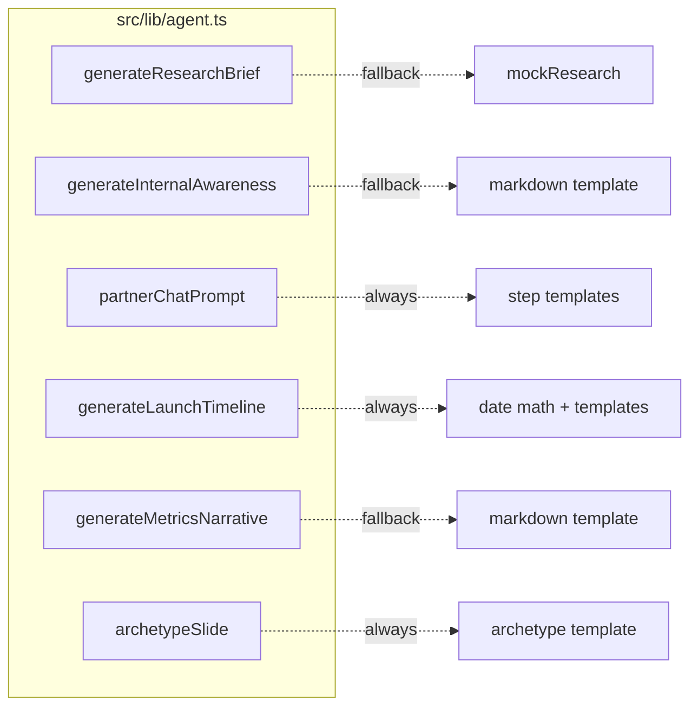

# 4. Agent design

The agent is **not** a single long-running chat session. It is a workflow with six discrete LLM-backed (or mock-backed) functions, all in `src/lib/agent.ts`.



Two modes are supported:

- **OpenAI mode** (`OPENAI_API_KEY` set) — uses the OpenAI Chat Completions API. Default model is `gpt-4o-mini` (override with `OPENAI_MODEL`).
- **Mock mode** (no key) — every LLM-backed function has a deterministic fallback that inspects the partner's name/website to pick a plausible vertical, archetype, and language.

Mock mode is **not** a degraded experience. It's good enough that during the demo you can flip between modes and the UI looks essentially the same. The agent badge in the header shows which mode is active.

## Functions

### `generateResearchBrief(input) → ResearchBrief`

Given `{ name, website, contact }`, returns:

```ts
{
  valueProp: string;
  idealCustomerProfile: string;
  archetype: "Data Affiliate" | "Go-To-Market" | "Platform" | "Channel";
  archetypeRationale: string;
  scope: string;
  competitiveLandscape: string;
  riskFlags: string[];
}
```

**OpenAI prompt** (system):

> You are ABC Co's Partner Strategy AI. Given a prospective partner's basic information, you produce a concise research brief. Return STRICT JSON with keys: valueProp, idealCustomerProfile, archetype, archetypeRationale, scope, competitiveLandscape, riskFlags (array of short strings). Keep each field under 90 words. Be specific, avoid fluff.

Response format is forced to JSON via `response_format: { type: "json_object" }`. If parsing fails for any reason (network, invalid JSON, unknown archetype), the function falls through to `mockResearch()`.

**Mock implementation** classifies the partner across five buckets — CRM / data / security / finance / generic — via a small regex over `name + host`. Each bucket has a hand-tuned value-prop template, ICP, scope, competitive snippet, and risk flags. Archetype is guessed from cues in the name (e.g. "advisory" → Channel, "reseller" → Platform), defaulting to `Data Affiliate`.

### `generateInternalAwareness(partner) → InternalAwareness`

Given a partner with research, returns `{ subject, body }` for the internal announcement email.

**OpenAI prompt** (system):

> You are the Partnerships Comms AI for ABC Co. Draft a polished INTERNAL email announcing a newly signed partner. Return JSON with "subject" and "body". The body must be in markdown, ~200-280 words, with these sections in this order: Overview, Value Prop, Ideal Customer Profile, Partner Archetype, Scope, What to expect next. Tone: confident, succinct, internal. No emojis. No salesy hype.

Mock implementation is a hand-written Markdown template that interpolates the partner fields with the same six section headings.

### `partnerChatPrompt({ partner, step, lastPartnerMessage? }) → string`

Returns the **next agent message** in the partner chat. This is template-driven only — there is no LLM call here. Why?

- The conversation steps are fixed and known.
- The partner's previous response is captured as structured input (review notes, integration text, target date).
- Stable, repeatable wording is more valuable than novelty for an intake flow.

Steps:

| `step` | Output (summary) |
| - | - |
| `welcome` | Greets contact, shows the research brief, asks for review. |
| `review-details` | Acknowledges, asks for integration description, prompts for upload. |
| `integration-details` | Acknowledges, asks for a realistic target completion date. |
| `target-date` | Closes the intake; asks the partner to wait for summary. |
| `summary` | Renders the canonical capture for the partner to confirm. |
| `closed` | Closes the thread, tells the partner the ABC team has everything. |

### `generateLaunchTimeline(partner) → LaunchTimeline`

Pure date math + Markdown templates. No LLM call. Produces:

- **5 milestones** at T-28, T-18, T-10, T-5, and T-0 days from the target date.
- **3 communications** (Coming Soon at T-21, Prepare for Launch at T-7, Live at T-0).

The target date is resolved with `resolveTargetDate(raw)`, which:

1. Tries `new Date(raw)`.
2. Strips ordinals (`21st` → `21`) and looks for `(day) (month) (year?)` or `(month) (day) (year?)`.
3. Handles qualifiers: `early`, `mid`, `late`, `end of`, `beginning of`.
4. Handles `Q1/Q2/Q3/Q4 [year]`.
5. Falls back to `today + 45 days` if everything fails.

This means a partner who types `"around late June"` still gets a valid timeline.

### `generateMetricsNarrative({ partner, kpis, successStories }) → MetricsRetro`

Given KPI key/values and free-text stories, returns:

```ts
{
  submittedAt: string;
  kpis: Record<string, string>;
  successStories: string;
  generatedNarrative: string; // markdown
  archetypeSlide: string;     // markdown
}
```

**OpenAI prompt** (system):

> You are ABC's Partner Comms AI. Write a polished 30-day post-launch update email body in markdown. Sections: Headline, KPI Snapshot (as a markdown table), Customer Stories, What's Next. ~250 words. No emojis. Tone: confident, specific, internal+external-safe.

The mock writes the same shape using a Markdown table built from the KPI map.

### `archetypeSlide(archetype, partner) → string`

A static template (not LLM-backed) that always returns the full four-archetype recap with the current partner highlighted. The content matches the slide narrative described in the original product brief: Data Affiliate (~91% of partners), Go-To-Market (~5%), Platform (~3%), Channel (~1%), with their distinct sales motions, KPIs, and monetization models.

## Fallback strategy

Every OpenAI-backed call is wrapped:

```ts
if (client) {
  try {
    // ... openai call + JSON parse + validation ...
    return parsed;
  } catch (err) {
    console.error("OpenAI X failed, falling back to mock", err);
  }
}
return mockX(input);
```

Failure modes covered:

- **Missing API key** — `client` is null, skipped entirely.
- **Network failure / 5xx** — caught, logged, mock fallback returns.
- **Malformed JSON** — `JSON.parse` throws, mock fallback returns.
- **Unknown archetype value** — validated against an enum; defaults to `Data Affiliate`.
- **Empty body returned** — typed conversions (`String(parsed.x ?? "")`) keep the shape intact.

Net effect: **the workflow never breaks because the LLM did**. The user sees content either way.

## Model & cost

Default model is `gpt-4o-mini`. Per-partner cost is well under a cent:

| Call | Tokens (in/out approx) |
| - | - |
| Research brief | 200 in / 400 out |
| Internal awareness | 500 in / 500 out |
| 30-day narrative | 400 in / 400 out |

That's three calls total per partner across the full lifecycle. Override the model with `OPENAI_MODEL=gpt-4o` (or any model your account has access to) for higher fidelity.

## Why no streaming?

We considered server-sent events for the LLM-backed steps, but:

- Research + internal awareness run in <5s with `gpt-4o-mini`.
- The "Run agent" button on `/new` already shows a shimmer + step label.
- Streaming complicates JSON-mode responses.

Adding streaming later is straightforward — `openai` SDK supports it and the API routes are isolated. The UX would benefit most on the 30-day retro where the response is the longest.
