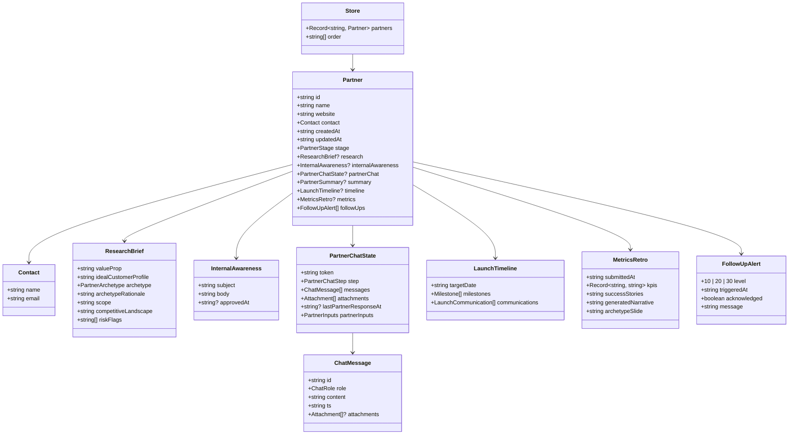

# 5. Data model

All domain types live in [`src/lib/types.ts`](../src/lib/types.ts). The store has a single root object `Store` containing every partner.

## High-level shape



## Enums

### `PartnerStage`

```ts
type PartnerStage =
  | "research"          // skeleton created, before research finishes
  | "internal-review"   // research + internal comm drafted; awaiting approval
  | "partner-chat"      // partner chat is open
  | "summarized"        // partner closed the chat; summary stored
  | "launching"         // launch timeline generated
  | "live"              // "New Partner is Live" comm marked sent
  | "retro";            // 30-day metrics submitted
```

### `PartnerArchetype`

```ts
type PartnerArchetype =
  | "Data Affiliate"   // integration-first, ~91% of partners
  | "Go-To-Market"     // outbound referral, ~5%
  | "Platform"         // resell, ~3%
  | "Channel";         // inbound lead, ~1%
```

### `PartnerChatStep`

```ts
type PartnerChatStep =
  | "welcome"               // initial greeting (only used on agent's first message)
  | "review-details"        // awaiting partner's edits/additions to the brief
  | "integration-details"   // awaiting integration description and (optional) upload
  | "target-date"           // awaiting target completion date
  | "summary"               // partner is reviewing the captured summary
  | "closed";               // intake done
```

`NEXT_STEP` in the message route is the canonical step→step transition map.

### `ChatRole`

```ts
type ChatRole = "agent" | "partner" | "system";
```

`system` is reserved; currently unused.

## Field reference

### `Partner`

| Field | Type | Notes |
| - | - | - |
| `id` | string | `nanoid(10)`. Used in URLs and as the store key. |
| `name` | string | Partner display name. |
| `website` | string | Stored exactly as entered; rendered with `https://` prefix on links. |
| `contact` | `Contact` | Primary partner contact. |
| `createdAt` | ISO string | Set on first upsert. |
| `updatedAt` | ISO string | Auto-bumped by `upsertPartner` / `updatePartner`. |
| `stage` | `PartnerStage` | Drives UI defaults and which actions are enabled. |
| `research` | `ResearchBrief?` | Present from `internal-review` onward. |
| `internalAwareness` | `InternalAwareness?` | Present from `internal-review` onward; `approvedAt` set on approval. |
| `partnerChat` | `PartnerChatState?` | Present from `partner-chat` onward. |
| `summary` | `PartnerSummary?` | Present from `summarized` onward — the canonical record of what was captured. |
| `timeline` | `LaunchTimeline?` | Present from `launching` onward. |
| `metrics` | `MetricsRetro?` | Present from `retro` onward. |
| `followUps` | `FollowUpAlert[]` | Always an array (possibly empty). |

### `ResearchBrief`

| Field | Type | Source | Notes |
| - | - | - | - |
| `valueProp` | string | LLM or mock | One paragraph. |
| `idealCustomerProfile` | string | LLM or mock | One paragraph. |
| `archetype` | enum | LLM or heuristic | One of four. |
| `archetypeRationale` | string | LLM or template | Why this archetype. |
| `scope` | string | LLM or mock | Phase 1 / Phase 2 split. |
| `competitiveLandscape` | string | LLM or mock | Differentiation. |
| `riskFlags` | string[] | LLM or fixed list | 0–6 entries, short phrases. |

### `PartnerChatState`

| Field | Type | Notes |
| - | - | - |
| `token` | string | `nanoid(14)`. The only access control for `/partner-chat/:token`. |
| `step` | enum | Where we are in the intake. |
| `messages` | `ChatMessage[]` | Full chronological log; agent + partner. |
| `attachments` | `Attachment[]` | Flat list of every file the partner uploaded across all turns. |
| `lastPartnerResponseAt` | ISO? | Updated on every partner message. Drives follow-up evaluation. |
| `partnerInputs` | object | Captured structured data: `reviewNotes`, `integrationDescription`, `targetDate` (always ISO once parsed). |

### `LaunchTimeline`

```ts
{
  targetDate: string;               // ISO; resolved from partner input or fallback
  milestones: Array<{
    name: string;
    date: string;                   // ISO
    description: string;
  }>;
  communications: LaunchCommunication[];
}
```

Always 5 milestones and exactly 3 communications. The communication `id` field is a discriminated union of `"coming-soon" | "prepare-for-launch" | "new-partner-live"` used for patching individual cards.

### `MetricsRetro`

| Field | Type | Notes |
| - | - | - |
| `submittedAt` | ISO string | When the user clicked "Generate 30-day comms". |
| `kpis` | `Record<string, string>` | Free-form. The UI defaults to four common keys but accepts any. |
| `successStories` | string | Free text. |
| `generatedNarrative` | string | Markdown — the 30-day email body. |
| `archetypeSlide` | string | Markdown — the four-archetype recap. |

### `FollowUpAlert`

| Field | Type | Notes |
| - | - | - |
| `level` | `10 | 20 | 30` | Day threshold that was crossed. |
| `triggeredAt` | ISO string | When the evaluator first added this alert. |
| `acknowledged` | boolean | Toggled by "Acknowledge" button. |
| `message` | string | Human-readable, copy fixed per level. |

## Stage → required fields

A handy reference for what should and shouldn't be present at each stage:

| Stage | research | internalAwareness | partnerChat | summary | timeline | metrics |
| - | - | - | - | - | - | - |
| `research` | (pending) | – | – | – | – | – |
| `internal-review` | ✓ | ✓ | – | – | – | – |
| `partner-chat` | ✓ | ✓ approved | ✓ open | – | – | – |
| `summarized` | ✓ | ✓ | ✓ closed | ✓ | – | – |
| `launching` | ✓ | ✓ | ✓ | ✓ | ✓ | – |
| `live` | ✓ | ✓ | ✓ | ✓ | ✓ (live sent) | – |
| `retro` | ✓ | ✓ | ✓ | ✓ | ✓ | ✓ |

The UI uses these invariants to decide which empty state to show on each tab.
